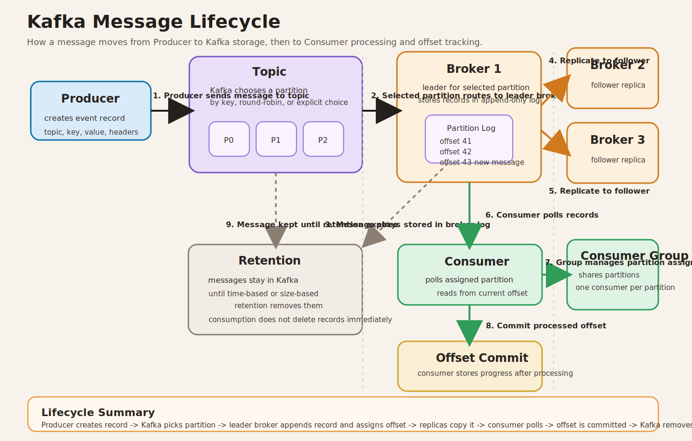

# Kafka Message Lifecycle

This document explains the full Kafka message lifecycle from the moment a producer creates a message until Kafka eventually removes that message based on retention rules.

## Core Components

- `Producer`
  The application that creates and sends messages to Kafka.
- `Topic`
  A named stream of records. Producers write to a topic, and consumers read from a topic.
- `Partition`
  A topic is split into partitions. Each partition is an ordered, append-only log.
- `Broker`
  A Kafka server that stores topic partitions and serves reads and writes.
- `Consumer`
  An application that reads messages from Kafka.
- `Consumer Group`
  A group of consumers that share the work of reading a topic. Each partition is assigned to one consumer in the group at a time.
- `Offset`
  The numeric position of a message inside a partition.

## Kafka Lifecycle Step by Step

### 1. Producer creates a message

The lifecycle starts when a producer application creates a message.

The message usually contains:

- a `topic`
- an optional `key`
- a `value`
- optional `headers`

The producer serializes the key and value into bytes before sending them to Kafka.

### 2. Producer chooses the target topic and partition

The producer does not place the message directly into a random location. Kafka must decide which partition of the topic will receive the message.

Common partition selection logic:

- If the producer sends a message with a `key`, Kafka usually hashes the key and maps it to a specific partition.
- If the producer sends a message without a key, Kafka may distribute messages across partitions for balancing.
- If the producer explicitly sets a partition, Kafka uses that partition directly.

This step matters because ordering in Kafka is guaranteed only within a single partition.

### 3. Producer sends the message to the broker leader for that partition

Kafka topics live across brokers. Each partition has a leader broker that handles writes.

The producer:

1. connects to the cluster using bootstrap servers
2. fetches metadata about the topic
3. learns which broker is leader for the chosen partition
4. sends the record to that leader broker

At this point the flow is:

`Producer -> Topic -> Partition -> Leader Broker`

### 4. Broker stores the message in the partition log

The leader broker appends the message to the end of the partition log.

Kafka stores records in order inside the partition. The newly written message receives an `offset`, such as:

- offset `0`
- offset `1`
- offset `2`

The offset is important because consumers use it to track which messages they have already processed.

### 5. Replication happens if the topic has replicas

Replication is optional in concept, but common in production.

If the partition has replicas:

- one broker is the leader
- one or more other brokers act as followers
- followers copy the leader's partition data

This improves durability and availability. If the leader broker fails, Kafka can elect a new leader from the in-sync replicas.

Depending on producer acknowledgement settings:

- `acks=0`
  The producer does not wait for confirmation.
- `acks=1`
  The leader acknowledges after local write.
- `acks=all`
  The leader acknowledges after the required replicas confirm the write.

### 6. Producer receives acknowledgement

After the write succeeds, the broker returns an acknowledgement to the producer.

The acknowledgement usually includes metadata such as:

- topic
- partition
- offset

This confirms where the message was stored.

### 7. Consumer polls Kafka for new messages

Consumers do not receive records by push. They actively ask Kafka for data.

The consumer sends a `poll()` request to Kafka and asks for available messages from its assigned partitions.

Kafka then returns records starting from the consumer's current position.

The flow becomes:

`Producer -> Broker/Partition Log -> Consumer`

### 8. Consumer Group shares partitions

If multiple consumers belong to the same consumer group:

- Kafka assigns partitions across those consumers
- each partition is read by only one consumer within that group
- this allows parallel processing without duplicate reads inside the same group

Example:

- Topic `orders` has 3 partitions
- Consumer Group `order-service` has 3 consumers
- each consumer can receive one partition

If a new consumer joins or one leaves, Kafka rebalances partition ownership inside the group.

### 9. Consumer processes the message

After polling, the consumer application handles the record.

Typical processing might include:

- validating the message
- updating a database
- calling another service
- publishing another event

The message itself stays in Kafka even after the consumer processes it. Kafka does not delete a message immediately after a successful read.

### 10. Consumer commits the offset

Once processing reaches a safe point, the consumer commits the offset.

Offset commit means:

- "This consumer group has successfully processed up to this position."

Kafka stores the committed offset separately from the message data itself.

Commit modes:

- automatic commit
- manual commit after successful processing

This matters because if the consumer crashes:

- it can restart from the last committed offset
- messages after that point may be re-read

### 11. Messages remain available until retention removes them

Kafka is not a queue that deletes messages immediately after one consumer reads them.

Messages remain in the partition log based on retention settings such as:

- time-based retention
- size-based retention
- log compaction in some topic configurations

This means:

- multiple consumer groups can read the same message independently
- a consumer can replay old messages if offsets are reset
- Kafka deletes old messages only when retention policy says they can be removed

## End-to-End Logical Flow

1. A producer creates a message.
2. Kafka selects a topic partition based on key, round-robin behavior, or explicit partition choice.
3. The producer sends the message to the leader broker for that partition.
4. The broker appends the message to the partition log and assigns an offset.
5. Replica brokers copy the message if replication is configured.
6. Kafka acknowledges the write to the producer.
7. A consumer in a consumer group polls Kafka for records from its assigned partition.
8. Kafka returns messages starting from the consumer's current offset position.
9. The consumer processes the message.
10. The consumer commits the offset to record progress.
11. Kafka retains the message until retention policy removes it.

## Important Beginner Notes

- A `topic` is a logical name, but actual ordering happens inside each `partition`.
- An `offset` is not global for the whole topic. It is unique only within one partition.
- A `consumer group` does not remove data from Kafka. It only tracks reading progress.
- Reading a message and deleting a message are different things in Kafka.
- Replication protects stored messages, but it does not replace proper consumer offset management.

## Summary

Kafka works as a durable distributed log.

The producer writes a message to a topic partition, the broker stores it with an offset, replicas may copy it, consumers poll and process it, consumer groups track progress through committed offsets, and Kafka keeps the message until retention rules remove it.
